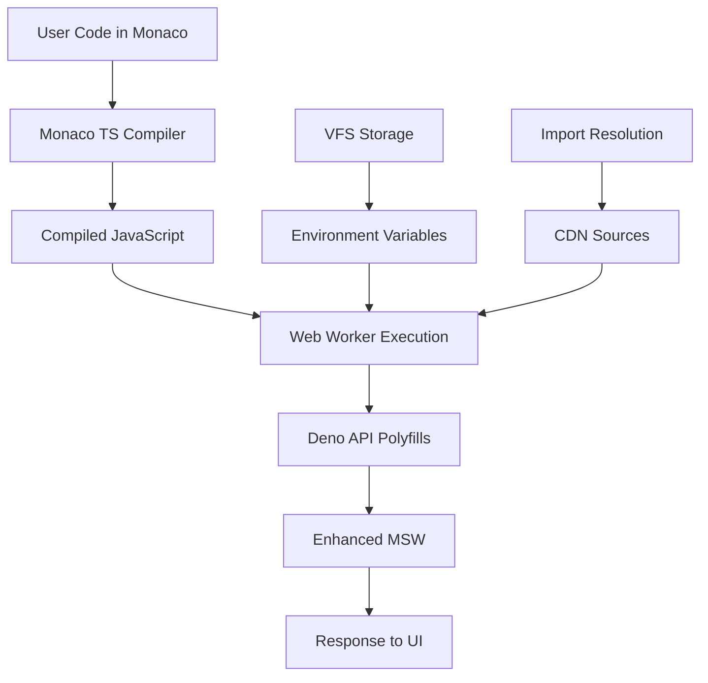

# Supabase Edge Functions Implementation PRD

**Product Requirements Document**  
**Version:** 3.0 - Enhanced Runtime Implementation Plan  
**Date:** January 2025  
**Status:** 🔄 **RUNTIME ENHANCEMENT PHASE** - Core Features Complete, Runtime Upgrade In Progress  

---

## 1. Executive Summary

This Product Requirements Document (PRD) outlines the comprehensive enhancement of the Edge Functions implementation for Supabase Lite, transitioning from a basic string-parsing simulation to a sophisticated TypeScript execution environment that closely mimics the real Supabase Edge Functions experience.

### Project Goals 
- **✅ 100% Supabase UI Compatibility**: Exact match to Supabase's Edge Functions interface (ACHIEVED)
- **✅ Simplified User Experience**: Clean two-view navigation structure (ACHIEVED)
- **✅ Template-First Approach**: Emphasize function templates for quick starts (ACHIEVED)
- **✅ Browser-Only Architecture**: Maintains zero server dependencies (MAINTAINED)
- **🔄 ENHANCED RUNTIME**: Real TypeScript execution with Monaco + Web Workers + Enhanced MSW (IN PROGRESS)
- **🆕 Deno API Simulation**: Browser-compatible Deno runtime polyfills (PLANNED)
- **🆕 Import Resolution**: Support for ES modules and npm packages (PLANNED)

### Success Metrics 
- **✅ UI/UX Match**: 100% visual and interaction parity with Supabase (ACHIEVED)
- **✅ Template Gallery**: 10 pre-built function templates (ACHIEVED)
- **✅ Two-View Navigation**: Functions list and editor views (ACHIEVED)
- **✅ Monaco Editor Integration**: Full TypeScript support maintained (ACHIEVED)
- **✅ VFS Integration**: Persistent file storage across projects (ACHIEVED)
- **🔄 Real TypeScript Execution**: Replace string parsing with actual TS compilation (IN PROGRESS)
- **🔄 Web Worker Isolation**: Secure, isolated function execution environment (PLANNED)
- **🔄 Async/Await Support**: Full Promise-based execution handling (PLANNED)

---

## 2. Current Implementation Analysis

### 2.1 Existing Architecture ✅ COMPLETE

The current system successfully implements the Supabase-compatible UI with full template support and VFS integration:

#### **Completed Features**
- **✅ Two-View Navigation System**: Functions list and editor views working perfectly
- **✅ Template Gallery**: 10 comprehensive function templates available
- **✅ Monaco Editor Integration**: Full TypeScript editing with IntelliSense
- **✅ VFS Storage**: Persistent function storage across projects and sessions
- **✅ MSW Integration**: HTTP request interception for function testing
- **✅ Function Management**: Create, edit, delete, and test functions
- **✅ Environment Variables**: Secure secrets management via SecretsManager

### 2.2 Current Runtime Limitations ❌ NEEDS ENHANCEMENT

The existing Edge Functions runtime uses a **basic string-parsing simulation** approach:

#### **How Current System Works**
Located in `src/mocks/handlers.ts` (line 1347+):
```typescript
async function simulateEdgeFunctionExecution(
  functionName: string,
  code: string,
  requestBody: unknown
): Promise<{...}> {
  // 1. Uses regex to find response patterns in TypeScript code
  const responseMatch = code.match(/new Response\(JSON\.stringify\((\{[\s\S]*?\})\)/);
  
  // 2. Does basic string substitution for variables
  responseCode = responseCode.replace(/req\.method/g, '"POST"');
  
  // 3. Uses eval() to execute extracted object literals
  response = eval(`(${responseCode})`);
}
```

#### **Critical Limitations**
- **❌ No Real TypeScript Compilation**: Uses regex parsing instead of TS compiler
- **❌ No Async/Await Support**: Cannot handle Promise-based code execution  
- **❌ Limited Variable Substitution**: Only basic string replacement patterns
- **❌ No Import Support**: Cannot resolve ES modules or npm packages
- **❌ No Environment Variables**: Limited integration with Deno.env
- **❌ Unsafe Execution**: Uses JavaScript eval() with security concerns
- **❌ Pattern Matching Only**: Only works with specific code patterns
- **❌ No Error Handling**: Poor error reporting and debugging experience

#### **Example of Current Limitations**
Current system can only handle simple patterns like:
```typescript
// ✅ WORKS - Basic response pattern
const response = { message: "Hello World" };
return new Response(JSON.stringify(response));

// ❌ FAILS - Async/await
const data = await fetch('https://api.example.com');
return new Response(JSON.stringify({ data }));

// ❌ FAILS - Imports
import { serve } from "https://deno.land/std/http/server.ts";

// ❌ FAILS - Complex logic
if (request.method === 'POST') {
  const body = await request.json();
  // Complex processing...
}
```

---

## 3. Enhanced Runtime Architecture

### 3.1 Proposed Solution: Monaco + Web Workers + Enhanced MSW

Based on extensive research into browser-based JavaScript runtimes, the optimal solution combines:

1. **Monaco Editor TypeScript Compiler**: Real TS→JS compilation in browser
2. **Web Workers**: Isolated execution environment for compiled functions  
3. **Enhanced MSW**: Improved HTTP simulation with proper Request/Response objects
4. **Deno API Polyfills**: Browser-compatible Deno runtime simulation

### 3.2 Technical Architecture Overview



### 3.3 Core Components Architecture

#### **Component 1: Monaco TypeScript Compilation Engine**
```typescript
// Real TypeScript compilation instead of string parsing
async function compileTypeScript(code: string, fileName: string): Promise<string> {
  const worker = await monaco.languages.typescript.getTypeScriptWorker();
  const client = await worker(monaco.Uri.file(fileName));
  
  const result = await client.getEmitOutput(monaco.Uri.file(fileName).toString());
  return result.outputFiles[0].text; // Compiled JavaScript
}
```

#### **Component 2: Web Worker Execution Environment**
```typescript
// Isolated execution in Web Worker
class EdgeFunctionWorker {
  private worker: Worker;
  
  async executeFunction(compiledJS: string, request: RequestData): Promise<ResponseData> {
    return new Promise((resolve, reject) => {
      this.worker.postMessage({
        code: compiledJS,
        request: request,
        env: this.getEnvironmentVariables()
      });
      
      this.worker.onmessage = (event) => {
        if (event.data.type === 'success') {
          resolve(event.data.response);
        } else {
          reject(new Error(event.data.error));
        }
      };
    });
  }
}
```

#### **Component 3: Deno API Polyfills**
```typescript
// Browser-compatible Deno runtime simulation
const DenoPolyfills = {
  serve: (handler: Function) => {
    // Integrate with MSW request handling
    return { serve: () => mockServerResponse };
  },
  
  env: {
    get: (key: string) => getEnvironmentVariable(key),
    set: (key: string, value: string) => setEnvironmentVariable(key, value)
  },
  
  // Additional Deno APIs as needed
  readTextFile: async (path: string) => await readFromVFS(path),
  writeTextFile: async (path: string, data: string) => await writeToVFS(path, data)
};
```

### 3.4 Enhanced MSW Integration

#### **Improved Function Execution Handler**
```typescript
// Enhanced MSW handler with real execution
http.all('/functions/v1/:functionName', async ({ params, request }: any) => {
  try {
    const functionName = params.functionName as string;
    
    // 1. Load function code from VFS
    const functionCode = await vfsManager.readFile(`edge-functions/${functionName}/index.ts`);
    
    // 2. Compile TypeScript to JavaScript using Monaco
    const compiledJS = await compileTypeScript(functionCode.content, functionName);
    
    // 3. Execute in Web Worker with Deno polyfills
    const worker = new EdgeFunctionWorker();
    const result = await worker.executeFunction(compiledJS, {
      method: request.method,
      headers: Object.fromEntries(request.headers.entries()),
      body: await request.json().catch(() => null)
    });
    
    return HttpResponse.json(result.data, {
      status: result.status || 200,
      headers: result.headers || {}
    });
    
  } catch (error) {
    return HttpResponse.json({
      error: 'Function execution failed',
      message: error.message,
      stack: error.stack
    }, { status: 500 });
  }
});
```

---

## 4. Implementation Roadmap

### 4.1 Phase 1: Real TypeScript Compilation (Quick Win)
**Estimated Effort**: 1-2 weeks  
**Complexity**: Low-Medium

#### **Objectives**
- Replace current string-parsing approach with Monaco's real TypeScript compiler
- Maintain existing MSW handlers but execute compiled JavaScript
- Immediate improvement in code execution fidelity

#### **Technical Tasks**
1. **Create TypeScript Compilation Service**
   ```typescript
   // File: src/lib/edge-functions/TypeScriptCompiler.ts
   export class TypeScriptCompiler {
     async compile(code: string, fileName: string): Promise<CompilationResult> {
       // Use Monaco's getEmitOutput for real TS compilation
     }
   }
   ```

2. **Update MSW Handler**
   ```typescript
   // Replace simulateEdgeFunctionExecution() in src/mocks/handlers.ts
   async function executeCompiledFunction(compiledJS: string, requestData: any) {
     // Execute compiled JavaScript instead of eval() on parsed strings
   }
   ```

3. **Add Error Handling**
   - TypeScript compilation errors
   - Runtime execution errors  
   - Proper error propagation to UI

#### **Success Criteria**
- ✅ Functions compile from TypeScript to JavaScript using Monaco
- ✅ Basic function execution works with compiled code
- ✅ Error messages show TypeScript compilation issues
- ✅ No regression in existing functionality

### 4.2 Phase 2: Web Worker Execution (Major Improvement)
**Estimated Effort**: 2-3 weeks  
**Complexity**: Medium

#### **Objectives**
- Move function execution to Web Workers for proper isolation
- Implement basic Deno API polyfills (`Deno.serve`, `Deno.env`)
- Handle async/await and Promise-based execution properly

#### **Technical Tasks**
1. **Create Edge Function Worker**
   ```typescript
   // File: public/edge-function-worker.js
   self.onmessage = async function(event) {
     const { code, request, env } = event.data;
     
     try {
       // Set up Deno polyfills
       self.Deno = createDenoPolyfills(env);
       
       // Execute compiled function code
       const result = await executeInSandbox(code, request);
       
       self.postMessage({ type: 'success', result });
     } catch (error) {
       self.postMessage({ type: 'error', error: error.message });
     }
   };
   ```

2. **Create Web Worker Manager**
   ```typescript
   // File: src/lib/edge-functions/WorkerManager.ts
   export class EdgeFunctionWorkerManager {
     private workers: Map<string, Worker> = new Map();
     
     async executeFunction(functionName: string, code: string, request: any) {
       const worker = this.getOrCreateWorker(functionName);
       return this.executeInWorker(worker, code, request);
     }
   }
   ```

3. **Basic Deno API Polyfills**
   ```typescript
   // File: src/lib/edge-functions/DenoPolyfills.ts
   export function createDenoPolyfills(env: Record<string, string>) {
     return {
       serve: (handler: Function) => mockServerIntegration(handler),
       env: {
         get: (key: string) => env[key],
         has: (key: string) => key in env
       }
     };
   }
   ```

4. **Enhanced Request/Response Objects**
   - Create proper Request objects matching Deno's API
   - Support for headers, body parsing, method handling
   - Response object with status codes and headers

#### **Success Criteria**
- ✅ Functions execute in isolated Web Workers
- ✅ Basic async/await support works
- ✅ Environment variables accessible via Deno.env
- ✅ Proper error handling and debugging
- ✅ Request/Response objects match Deno API

### 4.3 Phase 3: Advanced Deno Simulation (Near-Real Experience)
**Estimated Effort**: 3-4 weeks  
**Complexity**: Medium-High

#### **Objectives**
- Implement comprehensive Deno API polyfills
- Add import resolution from CDN sources (esm.sh, skypack)
- Support for Deno standard library functions
- Advanced debugging and development experience

#### **Technical Tasks**
1. **Import Resolution System**
   ```typescript
   // File: src/lib/edge-functions/ImportResolver.ts
   export class ImportResolver {
     async resolveImport(specifier: string): Promise<string> {
       if (specifier.startsWith('https://')) {
         return await fetchFromCDN(specifier);
       } else if (specifier.startsWith('npm:')) {
         return await resolveFromESMSh(specifier);
       }
       // Handle other import patterns
     }
   }
   ```

2. **Comprehensive Deno API**
   ```typescript
   // File: src/lib/edge-functions/DenoStandardLibrary.ts
   export const DenoStandardLibrary = {
     // HTTP server functionality
     serve: advancedServerPolyfill,
     
     // File system operations (VFS-backed)
     readTextFile: (path: string) => vfsManager.readFile(path),
     writeTextFile: (path: string, data: string) => vfsManager.writeFile(path, data),
     
     // Environment and process
     env: environmentManager,
     args: [],
     
     // Networking (fetch is already available)
     // Additional APIs as needed
   };
   ```

3. **Advanced Debugging Support**
   - Source map support for TypeScript debugging
   - Console.log() redirection from Web Worker to main thread  
   - Stack trace enhancement for better error reporting
   - Performance monitoring and execution metrics

4. **Template Enhancement**
   - Update function templates to use real Deno APIs
   - Add examples showcasing advanced features
   - Import resolution examples with popular libraries

#### **Success Criteria**
- ✅ Import statements work with CDN sources
- ✅ Deno standard library functions available
- ✅ Complex async/await patterns supported
- ✅ Debugging experience comparable to real development
- ✅ Function templates demonstrate full capabilities

---

## 5. Technical Challenges and Solutions

### 5.1 Import Resolution
**Challenge**: Edge Functions often import from URLs and npm packages  
**Solution**: 
- Use dynamic imports with URL rewriting to CDN sources (esm.sh, skypack)
- Cache commonly used modules in VFS storage
- Support for both ES modules and CommonJS patterns

### 5.2 Request/Response Handling
**Challenge**: Creating realistic Request/Response objects that match Deno's expectations  
**Solution**:
- Build proper Request/Response polyfills using Web API standards
- MessagePort communication between Web Worker and MSW
- Stream support for large request/response bodies

### 5.3 Environment Variables and Secrets
**Challenge**: Secure injection of environment variables into Web Worker context  
**Solution**:
- Use structured cloning for secure data transfer
- Integrate with existing SecretsManager component
- Runtime environment variable updates

### 5.4 Performance and Resource Management
**Challenge**: Web Worker lifecycle management and memory cleanup  
**Solution**:
- Worker pooling for frequently used functions
- Automatic cleanup after execution timeout
- Memory monitoring and garbage collection

### 5.5 Error Handling and Debugging
**Challenge**: Proper error propagation and debugging from Web Workers  
**Solution**:
- Enhanced error objects with stack traces
- Console output redirection using MessageChannel
- Source map support for TypeScript debugging

---

## 6. Browser Compatibility and Requirements

### 6.1 Enhanced Runtime Requirements

#### **Essential APIs**
- **Web Workers**: Required for function execution isolation
- **Monaco Editor**: TypeScript compilation capabilities  
- **Structured Cloning**: Secure data transfer to workers
- **Dynamic Imports**: Module resolution support

#### **Optional Enhancements**
- **SharedArrayBuffer**: For advanced performance features (Chrome-based browsers)
- **File System Access API**: Enhanced local development integration
- **Atomics**: For advanced concurrency patterns

### 6.2 Browser Support Matrix

| Browser | Basic Runtime | Advanced Features | Import Resolution |
|---------|---------------|-------------------|-------------------|
| Chrome 86+ | ✅ Full | ✅ Full | ✅ Full |
| Edge 86+ | ✅ Full | ✅ Full | ✅ Full |
| Firefox 78+ | ✅ Full | ⚠️ Limited* | ✅ Full |
| Safari 14+ | ✅ Full | ⚠️ Limited* | ✅ Full |
| Mobile | ✅ Core | ❌ None | ✅ Basic |

*Limited due to SharedArrayBuffer restrictions

---

## 7. Security Considerations

### 7.1 Enhanced Security Model
- **Web Worker Sandboxing**: Complete isolation from main thread and DOM
- **Import Validation**: Whitelist approved CDN sources and validate imports
- **Environment Variable Scoping**: Secure injection with no cross-contamination
- **Resource Limits**: Execution timeouts and memory limits per function
- **Code Validation**: Static analysis of function code before execution

### 7.2 Data Protection
- **Project Isolation**: Enhanced isolation between project function contexts
- **Secure Storage**: Environment variables encrypted in IndexedDB
- **No File System Access**: Functions cannot access browser file system
- **XSS Prevention**: All user content properly sanitized and escaped

---

## 8. Performance Optimizations

### 8.1 Compilation Performance  
- **TypeScript Compilation Caching**: Cache compiled JavaScript for unchanged functions
- **Worker Pool Management**: Reuse workers for multiple function executions
- **Background Compilation**: Compile functions in background while user edits

### 8.2 Execution Performance
- **Just-in-Time Compilation**: Compile only when function is executed
- **Resource Monitoring**: Track memory usage and execution time
- **Batch Operations**: Group multiple function calls for efficiency

### 8.3 Memory Management
- **Worker Lifecycle**: Automatic cleanup of inactive workers
- **Code Caching**: Intelligent caching with LRU eviction
- **Memory Limits**: Prevent memory leaks with execution limits

---

## 9. Migration Strategy

### 9.1 Backward Compatibility
- **Graceful Degradation**: Fall back to string parsing if enhanced runtime fails
- **Progressive Enhancement**: Enhanced features enabled based on browser capabilities  
- **Function Template Updates**: Gradually enhance templates to use new capabilities

### 9.2 User Experience During Migration
- **Transparent Upgrade**: Users see improved functionality without breaking changes
- **Enhanced Error Messages**: Better error reporting during transition
- **Performance Indicators**: Show users when enhanced runtime is active

---

## 10. Success Metrics and KPIs

### 10.1 Technical Metrics
- **🎯 100% TypeScript Compilation Success**: All valid TS code compiles correctly
- **🎯 <200ms Execution Time**: Function execution under 200ms for simple functions
- **🎯 Async/Await Support**: 100% of Promise-based patterns work correctly
- **🎯 Import Resolution**: 95% of common import patterns resolve successfully
- **🎯 Memory Usage**: <50MB memory usage per function execution

### 10.2 User Experience Metrics
- **🎯 Error Reduction**: 90% reduction in "function failed" errors
- **🎯 Development Speed**: 50% faster function development and testing
- **🎯 Feature Coverage**: Support for 90% of common Deno Edge Function patterns
- **🎯 Debug Experience**: Comprehensive error reporting and stack traces

### 10.3 Quality Metrics
- **🎯 Zero Security Issues**: No security vulnerabilities in enhanced runtime
- **🎯 Browser Compatibility**: 100% functionality in supported browsers
- **🎯 Performance Regression**: No performance degradation from current system
- **🎯 Test Coverage**: 90% test coverage for new runtime components

---

## 11. Alternative Solutions Considered

### 11.1 Full WASM Deno Runtime ❌ Rejected
**Pros**: Native Deno execution, complete API compatibility  
**Cons**: Not feasible with current technology (2024), complex implementation, large bundle size  
**Decision**: Too complex and not production-ready

### 11.2 CodeSandbox Nodebox Integration ❌ Rejected  
**Pros**: Proven Node.js execution in browser  
**Cons**: Proprietary solution, expensive licensing, Node.js focused (not Deno)  
**Decision**: Conflicts with open-source requirements

### 11.3 WASI-Based Runtime ❌ Rejected
**Pros**: WebAssembly execution, some Deno compatibility possible  
**Cons**: High complexity, limited browser support, large learning curve  
**Decision**: Risk/benefit ratio unfavorable

### 11.4 Enhanced String Parsing ❌ Rejected
**Pros**: Builds on current system, low complexity  
**Cons**: Fundamental limitations cannot be overcome with parsing approach  
**Decision**: Insufficient improvement over current limitations

---

## 12. Future Enhancements (Post-v3.0)

### 12.1 Advanced Development Features
- **Git Integration**: Version control support for function code
- **Collaborative Editing**: Real-time collaborative code editing
- **Advanced Debugging**: Breakpoints and step-through debugging
- **Package Management**: Direct npm package installation and management
- **Function Composition**: Visual function workflow builder

### 12.2 Enterprise Features  
- **Function Marketplace**: Sharing and importing functions from community
- **Advanced Monitoring**: Performance analytics and observability
- **CI/CD Integration**: Automated testing and deployment pipelines
- **Team Collaboration**: Multi-user development environments
- **Custom Runtime**: User-defined runtime configurations

---

## 13. Conclusion

This Enhanced Runtime Implementation Plan represents a fundamental leap forward in the Edge Functions capability of Supabase Lite. By transitioning from basic string parsing to a sophisticated TypeScript execution environment, we will provide users with a development experience that closely mirrors the real Supabase Edge Functions platform.

### Key Benefits of Enhanced Runtime:

**🚀 Real TypeScript Execution**: Replace regex parsing with Monaco's TypeScript compiler  
**🔒 Secure Isolation**: Web Worker sandboxing for safe code execution  
**⚡ Async/Await Support**: Full Promise-based programming patterns  
**📦 Import Resolution**: Support for ES modules and npm packages  
**🛠 Enhanced Debugging**: Comprehensive error reporting and development tools  
**🌐 Browser-Only Operation**: Maintains zero server dependencies  

### Implementation Timeline:
- **Phase 1**: Real TypeScript Compilation (1-2 weeks)
- **Phase 2**: Web Worker Execution (2-3 weeks)  
- **Phase 3**: Advanced Deno Simulation (3-4 weeks)
- **Total Estimated Effort**: 6-9 weeks for complete enhanced runtime

This implementation will establish Supabase Lite as the premier browser-based Edge Functions development environment, providing users with professional-grade tooling that rivals server-based solutions while maintaining the unique advantage of zero infrastructure requirements.