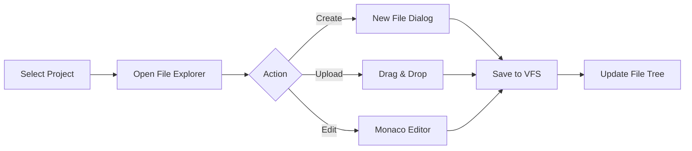
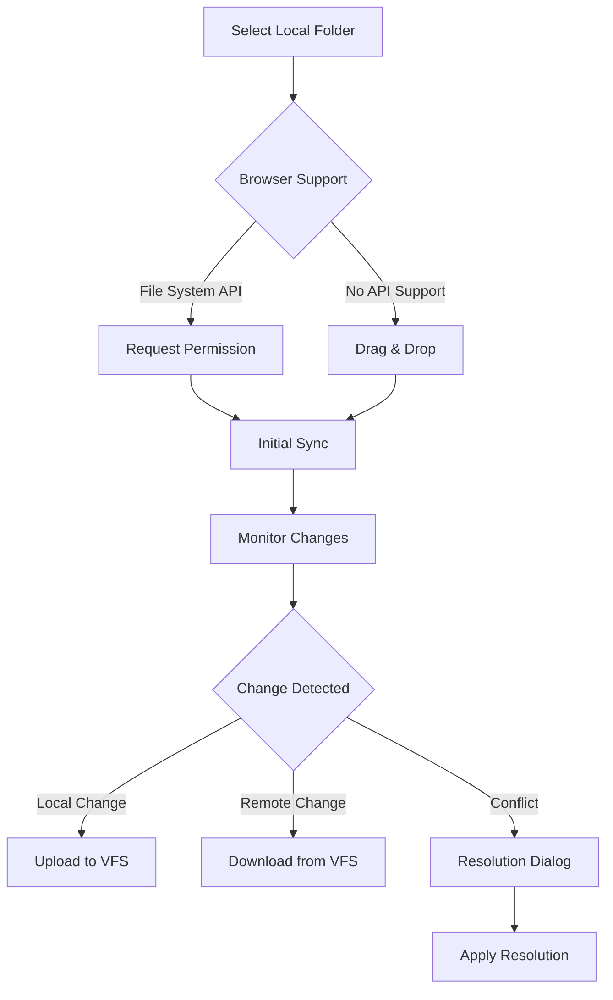

# Virtual File System (VFS) for Application Hosting
## Product Requirements Document

### Table of Contents
1. [Executive Summary](#1-executive-summary)
2. [Problem Statement and Objectives](#2-problem-statement-and-objectives)
3. [Technical Architecture](#3-technical-architecture)
4. [Implementation Phases](#4-implementation-phases)
5. [Security Considerations](#5-security-considerations-and-mitigation-strategies)
6. [API Design](#6-api-design-and-msw-handler-specifications)
7. [User Experience Flow](#7-user-experience-flow)
8. [Testing Strategy](#8-testing-strategy)
9. [Success Metrics](#9-success-metrics)
10. [Risk Assessment](#10-risk-assessment-and-mitigation)

---

## 1. Executive Summary

The Virtual File System (VFS) is a browser-based file management and application hosting system that will extend Supabase Lite's capabilities to allow users to create, deploy, and manage static web applications entirely within the browser. This feature leverages the existing architecture patterns including IndexedDB storage, MSW handlers, and the project management system to provide a seamless development experience without requiring server-side infrastructure.

**Key Value Propositions:**
- Enable complete web application development and deployment within the browser
- Maintain 100% browser-only operation consistent with Supabase Lite's architecture
- Provide a sandbox environment for testing applications against Supabase Lite APIs
- Integrate seamlessly with the existing project management and database systems
- Zero server-side dependencies - everything runs in the browser tab

---

## 2. Problem Statement and Objectives

### Problem Statement
Developers using Supabase Lite currently face challenges when trying to:
- Test their applications against their local Supabase instance without complex proxy setups
- Rapidly prototype and iterate on web applications within the same environment
- Deploy and host static applications without external infrastructure
- Manage multiple application versions within their projects
- Access Supabase Lite APIs from their applications without CORS issues

### Primary Objectives
1. **Browser-Native Development**: Enable complete application development without server dependencies
2. **Seamless Integration**: Integrate with existing project management and database systems
3. **Security Isolation**: Provide secure sandboxing for user code execution
4. **Developer Experience**: Offer intuitive file management and deployment workflows
5. **Performance**: Maintain responsive performance with efficient file storage and serving

### Success Criteria
- File operations complete within 100ms for files under 1MB
- Support for at least 1000 files per project
- Zero security vulnerabilities in code execution sandbox
- 95% user satisfaction with the development workflow
- Full Supabase.js compatibility for hosted applications

---

## 3. Technical Architecture

### 3.1 Core Components

#### VFS Manager (`src/lib/vfs/VFSManager.ts`)
```typescript
class VFSManager {
  private static instance: VFSManager;
  private fileStorage: Map<string, VFSFile>;
  private projectStorageKeys: Map<string, string>; // projectId -> storageKey
  
  // File operations
  async createFile(path: string, content: string, mimeType?: string): Promise<VFSFile>
  async readFile(path: string): Promise<VFSFile | null>
  async updateFile(path: string, content: string): Promise<VFSFile>
  async deleteFile(path: string): Promise<boolean>
  async listFiles(directory?: string): Promise<VFSFile[]>
  
  // Directory operations
  async createDirectory(path: string): Promise<VFSDirectory>
  async deleteDirectory(path: string, recursive?: boolean): Promise<boolean>
  
  // Project integration
  async switchToProject(projectId: string): Promise<void>
  async exportProject(): Promise<Blob>
  async importProject(data: Blob): Promise<void>
}
```

#### File Storage Layer (`src/lib/vfs/FileStorage.ts`)
```typescript
interface VFSFile {
  id: string;
  path: string;
  name: string;
  content: string;
  mimeType: string;
  size: number;
  createdAt: Date;
  updatedAt: Date;
  directory: string;
  projectId: string;
}

interface VFSDirectory {
  path: string;
  name: string;
  children: string[]; // file paths
  createdAt: Date;
  projectId: string;
}

class FileStorage {
  private readonly STORAGE_PREFIX = 'vfs_';
  private readonly MAX_FILE_SIZE = 10 * 1024 * 1024; // 10MB
  
  async saveFile(projectId: string, file: VFSFile): Promise<void>
  async loadFile(projectId: string, path: string): Promise<VFSFile | null>
  async deleteFile(projectId: string, path: string): Promise<void>
  async listFiles(projectId: string): Promise<VFSFile[]>
}
```

### 3.2 MSW Integration for File Serving

#### VFS Handler (`src/mocks/handlers/vfsHandler.ts`)
```typescript
// Serve static files from VFS
http.get('/vfs/:projectId/*', withProjectResolution(async ({ params, request }) => {
  const projectId = params.projectId as string;
  const filePath = request.url.split('/vfs/')[1].split('/').slice(1).join('/');
  
  const file = await vfsManager.readFile(filePath);
  if (!file) {
    return HttpResponse.json({ error: 'File not found' }, { status: 404 });
  }
  
  return HttpResponse.text(file.content, {
    headers: {
      'Content-Type': file.mimeType,
      'Cache-Control': 'no-cache',
      'Access-Control-Allow-Origin': '*'
    }
  });
}));

// Handle SPA routing
http.get('/app/:projectId/*', withProjectResolution(async ({ params }) => {
  // Serve index.html for all non-file requests (SPA routing)
  const indexFile = await vfsManager.readFile('index.html');
  return HttpResponse.text(indexFile?.content || '', {
    headers: { 'Content-Type': 'text/html' }
  });
}));
```

### 3.3 Security Sandbox

#### Code Execution Sandbox (`src/lib/vfs/CodeSandbox.ts`)
```typescript
class CodeSandbox {
  private iframe: HTMLIFrameElement;
  private trustedOrigins: Set<string>;
  
  async executeCode(html: string, css: string, js: string): Promise<void> {
    // Create sandboxed iframe with restricted permissions
    const sandboxPolicy = [
      'allow-scripts',
      'allow-same-origin', // Required for MSW API access
    ].join(' ');
    
    this.iframe.sandbox.value = sandboxPolicy;
    
    // Inject security headers and CSP
    const secureHtml = this.injectSecurityHeaders(html, css, js);
    this.iframe.srcdoc = secureHtml;
  }
  
  private injectSecurityHeaders(html: string, css: string, js: string): string {
    const csp = [
      "default-src 'self'",
      "script-src 'self' 'unsafe-inline'",
      "style-src 'self' 'unsafe-inline'",
      "connect-src 'self' localhost:*",
      "img-src 'self' data: blob:"
    ].join('; ');
    
    return `
      <!DOCTYPE html>
      <html>
      <head>
        <meta http-equiv="Content-Security-Policy" content="${csp}">
        <style>${css}</style>
      </head>
      <body>
        ${html}
        <script>${js}</script>
      </body>
      </html>
    `;
  }
}
```

### 3.4 Storage Architecture

```
IndexedDB Structure:
├── supabase_lite_db (existing)
│   └── project_{uuid} (PGlite database)
└── supabase_lite_vfs (new)
    └── project_{uuid}_files
        ├── metadata (file tree structure)
        ├── files (actual file content)
        ├── deployments (deployment history)
        └── sync_state (folder sync metadata)
```

### 3.5 Local Folder Sync Architecture

#### Sync Manager (`src/lib/vfs/SyncManager.ts`)
```typescript
interface SyncManager {
  // File System Access API integration
  private dirHandle: FileSystemDirectoryHandle | null;
  private syncInterval: number;
  private fileSnapshots: Map<string, number>; // path -> lastModified
  
  // One-time sync operations
  async syncFolder(dirHandle: FileSystemDirectoryHandle): Promise<SyncResult>;
  async importFolder(files: File[]): Promise<ImportResult>;
  
  // Continuous sync
  async startWatching(dirHandle: FileSystemDirectoryHandle): Promise<void>;
  stopWatching(): void;
  
  // Conflict resolution
  resolveConflict(file: VFSFile, strategy: 'local' | 'remote' | 'merge'): Promise<void>;
  
  // Sync configuration
  setSyncFilter(patterns: string[]): void; // .gitignore style
  setSyncDirection(direction: 'upload' | 'download' | 'bidirectional'): void;
  getSyncStatus(): SyncStatus;
}

interface SyncStatus {
  isActive: boolean;
  lastSync: Date | null;
  filesTracked: number;
  filesIgnored: number;
  pendingChanges: number;
  folderPath: string;
}
```

#### Sync Methods

**1. File System Access API** (Primary Method)
- Direct access to local file system with user permission
- Continuous monitoring for changes
- Bidirectional sync capability
- Supported in Chrome, Edge, and Opera

**2. Drag & Drop Upload** (Fallback Method)
- Works in all modern browsers
- One-way sync (upload only)
- No additional permissions required
- Supports folder structure preservation

**3. WebSocket Bridge** (Optional Enhancement)
- For advanced users with CLI tools
- Real-time sync from development environment
- Requires additional setup

---

## 4. Implementation Phases

### Phase 1: Core VFS Infrastructure (Weeks 1-2)

#### Week 1: Storage Foundation
- [ ] **VFSManager Implementation**
  - [ ] Create singleton VFSManager class following DatabaseManager pattern
  - [ ] Implement file CRUD operations with IndexedDB storage
  - [ ] Add directory management functionality
  - [ ] Integrate with existing ProjectManager for project isolation
  - [ ] Add comprehensive error handling and validation

- [ ] **File Storage Layer**
  - [ ] Create FileStorage class with IndexedDB backend
  - [ ] Implement file size and type validation
  - [ ] Add file compression for efficient storage
  - [ ] Create storage cleanup mechanisms
  - [ ] Add storage quota monitoring

#### Week 2: Testing and Optimization
- [ ] **Testing Infrastructure**
  - [ ] Write unit tests for VFSManager operations
  - [ ] Create integration tests with ProjectManager
  - [ ] Add performance tests for large file operations
  - [ ] Implement test data generators and cleanup utilities
  - [ ] Add edge case testing (unicode filenames, large files)

- [ ] **Performance Optimization**
  - [ ] Implement lazy loading for file tree
  - [ ] Add caching layer for frequently accessed files
  - [ ] Optimize IndexedDB transactions
  - [ ] Add batch operations for multiple files
  - [ ] Implement file content deduplication

### Phase 2: MSW Handler Integration (Weeks 3-4)

#### Week 3: Handler Implementation
- [ ] **VFS MSW Handlers**
  - [ ] Create file serving handlers using existing patterns
  - [ ] Implement MIME type detection and serving
  - [ ] Add SPA routing support for applications
  - [ ] Integrate with existing project resolution system
  - [ ] Add caching headers and optimization

- [ ] **Application Hosting**
  - [ ] Create application deployment pipeline
  - [ ] Implement environment variable injection
  - [ ] Add build process simulation
  - [ ] Create application versioning system
  - [ ] Add rollback capabilities

#### Week 4: API Integration
- [ ] **API Bridge**
  - [ ] Ensure hosted apps can access Supabase Lite APIs
  - [ ] Implement CORS handling for cross-origin requests
  - [ ] Add API endpoint proxying if needed
  - [ ] Create development vs production environment separation
  - [ ] Add authentication token forwarding

- [ ] **Testing**
  - [ ] Test API access from hosted applications
  - [ ] Verify database operations work correctly
  - [ ] Test authentication flow integration
  - [ ] Validate real-time subscriptions
  - [ ] Test edge cases and error scenarios

### Phase 3: User Interface (Weeks 5-6)

#### Week 5: File Management UI
- [ ] **File Explorer Component**
  - [ ] Create tree-view file browser using shadcn/ui components
  - [ ] Implement file and folder creation, editing, deletion
  - [ ] Add drag-and-drop file upload functionality
  - [ ] Create file preview capabilities
  - [ ] Add search and filtering features

- [ ] **Code Editor Integration**
  - [ ] Integrate Monaco Editor for file editing
  - [ ] Add syntax highlighting for common file types
  - [ ] Implement auto-save functionality
  - [ ] Add code formatting and validation
  - [ ] Create multi-file editing with tabs

#### Week 6: Deployment Interface & Local Sync
- [ ] **Deployment UI**
  - [ ] Create deployment configuration UI
  - [ ] Add build settings and environment variables
  - [ ] Implement deployment history and rollback UI
  - [ ] Create application preview functionality
  - [ ] Add deployment status monitoring

- [ ] **Local Folder Sync Implementation**
  - [ ] Implement File System Access API integration
  - [ ] Create folder selection UI with permission handling
  - [ ] Add drag-and-drop folder upload as fallback
  - [ ] Implement file change detection and syncing
  - [ ] Create sync status indicator and controls
  - [ ] Add .gitignore-style file filtering
  - [ ] Implement conflict resolution UI
  - [ ] Add bidirectional sync option for supported browsers

- [ ] **Developer Tools**
  - [ ] Add console output display
  - [ ] Create network request monitor
  - [ ] Implement error tracking and display
  - [ ] Add performance metrics display
  - [ ] Create debugging tools integration

### Phase 4: Security and Sandboxing (Week 7)

- [ ] **Code Execution Sandbox**
  - [ ] Implement iframe-based code execution sandbox
  - [ ] Add Content Security Policy enforcement
  - [ ] Create secure communication channels
  - [ ] Implement resource usage monitoring
  - [ ] Add execution timeout mechanisms

- [ ] **Security Validation**
  - [ ] Implement malicious code detection
  - [ ] Add file type validation and sanitization
  - [ ] Create access control for sensitive operations
  - [ ] Add audit logging for security events
  - [ ] Implement rate limiting for file operations

- [ ] **Security Testing**
  - [ ] Penetration testing for sandbox escapes
  - [ ] XSS vulnerability scanning
  - [ ] Resource exhaustion testing
  - [ ] Data isolation verification
  - [ ] Security audit and review

### Phase 5: Advanced Features (Week 8)

- [ ] **Application Templates**
  - [ ] Create template system for common application types
  - [ ] Add React, Vue, vanilla JS templates
  - [ ] Implement template customization
  - [ ] Create template marketplace/gallery
  - [ ] Add template export/import functionality

- [ ] **Developer Experience**
  - [ ] Add hot reload capability
  - [ ] Implement version control integration
  - [ ] Create collaborative features
  - [ ] Add deployment automation
  - [ ] Implement CI/CD pipeline simulation

- [ ] **Documentation and Examples**
  - [ ] Write comprehensive user documentation
  - [ ] Create tutorial videos
  - [ ] Build example applications
  - [ ] Add inline help and tooltips
  - [ ] Create migration guides

---

## 5. Security Considerations and Mitigation Strategies

### 5.1 Code Execution Security

#### Risks
- **Malicious JavaScript execution**: User code could attempt to access sensitive data
- **Cross-site scripting (XSS)**: Injected scripts could compromise the application
- **Browser API abuse**: Access to powerful browser APIs could be exploited
- **Resource exhaustion**: Infinite loops or memory leaks could crash the browser

#### Mitigation Strategies
- **Strict Content Security Policy**
  ```javascript
  const csp = {
    'default-src': ["'self'"],
    'script-src': ["'self'", "'unsafe-inline'"], // Required for user JS
    'connect-src': ["'self'", "localhost:*"], // For API access
    'frame-ancestors': ["'none'"], // Prevent clickjacking
    'form-action': ["'self'"]
  };
  ```

- **Iframe Sandboxing**
  ```html
  <iframe 
    sandbox="allow-scripts allow-same-origin"
    src="blob:..." 
    csp="..." />
  ```

- **Code Analysis**
  - Static analysis for dangerous patterns
  - Blocking eval() and Function() constructor
  - Preventing access to parent window

- **Resource Limits**
  - CPU usage monitoring via Performance API
  - Memory limit enforcement
  - Execution timeout (30 seconds default)

### 5.2 Data Storage Security

#### Risks
- **Cross-project data access**: Files from one project accessed by another
- **Data corruption**: Malformed data corrupting storage
- **Storage exhaustion**: Filling up browser storage quota

#### Mitigation Strategies
- **Project Isolation**
  ```typescript
  const getStorageKey = (projectId: string, path: string) => {
    const hash = await crypto.subtle.digest('SHA-256', 
      new TextEncoder().encode(projectId)
    );
    return `vfs_${hash}_${path}`;
  };
  ```

- **Data Validation**
  - Input sanitization for all file operations
  - File size limits (10MB default)
  - MIME type validation
  - Path traversal prevention

- **Storage Management**
  - Quota monitoring and alerts
  - Automatic cleanup of old files
  - Compression for text files
  - Binary file optimization

### 5.3 Network Security

#### Risks
- **API key exposure**: User applications could expose API keys
- **Data exfiltration**: Sending data to unauthorized endpoints
- **Man-in-the-middle**: Interception of API requests

#### Mitigation Strategies
- **API Security**
  - Scoped API tokens for applications
  - Rate limiting per application
  - Request origin validation
  - API usage monitoring

- **Network Restrictions**
  - Whitelist allowed domains
  - Block external requests by default
  - HTTPS enforcement for production
  - Certificate pinning for API calls

---

## 6. API Design and MSW Handler Specifications

### 6.1 VFS REST API

#### File Operations
```typescript
// Create or update file
POST /api/vfs/files
Body: {
  projectId: string;
  path: string;
  content: string;
  mimeType?: string;
  encoding?: 'utf-8' | 'base64';
}
Response: {
  file: VFSFile;
  message: string;
}

// Read file
GET /api/vfs/files?projectId={id}&path={path}
Response: {
  file: VFSFile;
}

// Delete file
DELETE /api/vfs/files?projectId={id}&path={path}
Response: {
  success: boolean;
  message: string;
}

// List files
GET /api/vfs/files?projectId={id}&directory={path}
Response: {
  files: VFSFile[];
  directories: VFSDirectory[];
}
```

#### Folder Sync Operations
```typescript
// Start folder sync
POST /api/vfs/sync/start
Body: {
  projectId: string;
  folderHandle?: string; // For File System Access API
  syncConfig: {
    direction: 'upload' | 'download' | 'bidirectional';
    ignorePatterns?: string[]; // .gitignore style patterns
    autoSync?: boolean;
    conflictStrategy?: 'local' | 'remote' | 'prompt';
  };
}
Response: {
  syncId: string;
  status: 'active' | 'paused' | 'error';
  filesTracked: number;
}

// Stop folder sync
POST /api/vfs/sync/stop
Body: {
  projectId: string;
  syncId: string;
}

// Get sync status
GET /api/vfs/sync/status?projectId={id}
Response: {
  isActive: boolean;
  lastSync: Date;
  filesTracked: number;
  filesIgnored: number;
  pendingChanges: number;
  folderPath: string;
  conflicts: ConflictFile[];
}

// Resolve sync conflict
POST /api/vfs/sync/resolve-conflict
Body: {
  projectId: string;
  filePath: string;
  resolution: 'local' | 'remote' | 'merge';
  mergedContent?: string; // If resolution is 'merge'
}
```

#### Application Deployment
```typescript
// Deploy application
POST /api/vfs/deploy
Body: {
  projectId: string;
  entryPoint: string;
  buildConfig?: {
    framework?: 'react' | 'vue' | 'vanilla';
    buildCommand?: string;
    outputDirectory?: string;
  };
  environment?: Record<string, string>;
}
Response: {
  deploymentId: string;
  url: string;
  status: 'success' | 'building' | 'failed';
}

// Get deployment status
GET /api/vfs/deployments/{deploymentId}
Response: {
  deployment: {
    id: string;
    projectId: string;
    status: string;
    url: string;
    createdAt: Date;
    logs: string[];
  };
}
```

### 6.2 MSW Handler Implementation

```typescript
// In src/mocks/handlers.ts
import { vfsHandlers } from './handlers/vfsHandlers';

export const handlers = [
  ...existingHandlers,
  ...vfsHandlers, // New VFS handlers
];

// In src/mocks/handlers/vfsHandlers.ts
export const vfsHandlers = [
  // File serving
  http.get('/vfs/:projectId/*', withProjectResolution(serveFile)),
  
  // Application serving
  http.get('/app/:projectId/*', withProjectResolution(serveApp)),
  
  // API endpoints
  http.post('/api/vfs/files', withProjectResolution(createFile)),
  http.get('/api/vfs/files', withProjectResolution(readFile)),
  http.delete('/api/vfs/files', withProjectResolution(deleteFile)),
  
  // Deployment
  http.post('/api/vfs/deploy', withProjectResolution(deployApp)),
  http.get('/api/vfs/deployments/:id', withProjectResolution(getDeployment)),
];
```

### 6.3 Integration with Existing APIs

Applications hosted in VFS will have access to all existing Supabase Lite APIs:

```javascript
// From within a hosted application
const supabase = createClient(
  window.location.origin, // Same origin - no CORS issues!
  'your-anon-key'
);

// All standard operations work
const { data, error } = await supabase
  .from('users')
  .select('*');
```

---

## 7. User Experience Flow

### 7.1 File Management Workflow



### 7.2 Application Development Workflow

1. **Project Setup**
   - User selects existing project or creates new one
   - System initializes VFS for the project
   - Default files created (index.html, style.css, script.js)

2. **Development**
   - User edits files in Monaco Editor
   - Auto-save after 2 seconds of inactivity
   - Live preview updates automatically
   - Console output displayed in UI

3. **Testing**
   - User clicks "Preview" button
   - Application loads in sandboxed iframe
   - API requests work seamlessly
   - Errors displayed in console panel

4. **Deployment**
   - User clicks "Deploy" button
   - System packages files
   - Generates unique URL
   - Application accessible at /app/{projectId}/

### 7.3 Local Folder Sync Workflow



1. **Initial Setup**
   - User clicks "Sync Local Folder" button
   - Browser checks for File System Access API support
   - If supported: Shows folder picker dialog
   - If not supported: Shows drag & drop interface
   - User grants permission for folder access

2. **Configuration**
   - User configures sync settings:
     - Sync direction (upload/download/bidirectional)
     - File filters (.gitignore patterns)
     - Auto-sync enable/disable
     - Conflict resolution strategy

3. **Active Sync**
   - System monitors folder for changes (polling every 2 seconds)
   - Changes detected and queued for sync
   - Progress indicator shows sync status
   - Conflicts prompt user for resolution

4. **Sync Management**
   ```
   ┌─────────────────────────────────────────┐
   │ Sync Local Folder                      │
   ├─────────────────────────────────────────┤
   │ Current Folder: ~/projects/my-app      │
   │ [Select Folder] [Change]                │
   │                                         │
   │ Sync Status: ● Active                  │
   │ Last Sync: 2 seconds ago               │
   │ Files: 47 synced, 2 ignored           │
   │                                         │
   │ ▼ Options                              │
   │   ☑ Auto-sync changes                  │
   │   ☐ Bidirectional sync                 │
   │   ☑ Ignore node_modules                │
   │   ☑ Follow .gitignore                  │
   │                                         │
   │ Recent Activity:                       │
   │ ↑ Updated: src/App.tsx (2s ago)       │
   │ ↑ Created: src/utils.ts (15s ago)     │
   │ ⚠ Conflict: index.html (resolve)       │
   │                                         │
   │ [Stop Sync] [Pause] [Settings]         │
   └─────────────────────────────────────────┘
   ```

### 7.4 UI Mockup Structure

```
┌─────────────────────────────────────────────────────────┐
│  Supabase Lite                                    [User] │
├─────────────────────────────────────────────────────────┤
│ Dashboard │ SQL │ Tables │ [Edge Functions] │ API │     │
├─────────────────────────────────────────────────────────┤
│ ┌──────────┬─────────────────────┬───────────────────┐ │
│ │File Tree │   Code Editor        │  Preview/Console  │ │
│ │          │                      │                   │ │
│ │ ▼ /      │ index.html           │ ┌───────────────┐│ │
│ │  ▶ src/  │ <!DOCTYPE html>      │ │               ││ │
│ │  ▶ public│ <html>               │ │  App Preview  ││ │
│ │  index.  │   <head>...</head>   │ │               ││ │
│ │  style.  │   <body>             │ └───────────────┘│ │
│ │  script. │     <h1>Hello</h1>   │ ┌───────────────┐│ │
│ │          │   </body>            │ │Console Output ││ │
│ │ [+] New  │ </html>              │ │> App loaded   ││ │
│ └──────────┴─────────────────────┴───────────────────┘ │
│ [Deploy] [Sync Folder] [Templates]               [Save] │
└─────────────────────────────────────────────────────────┘
```

---

## 8. Testing Strategy

### 8.1 Unit Testing

#### VFS Core Operations
```typescript
describe('VFSManager', () => {
  it('should create files with correct metadata', async () => {
    const file = await vfsManager.createFile('/test.txt', 'content');
    expect(file.path).toBe('/test.txt');
    expect(file.content).toBe('content');
    expect(file.mimeType).toBe('text/plain');
  });
  
  it('should enforce file size limits', async () => {
    const largeContent = 'x'.repeat(11 * 1024 * 1024); // 11MB
    await expect(
      vfsManager.createFile('/large.txt', largeContent)
    ).rejects.toThrow('File size exceeds limit');
  });
  
  it('should maintain project isolation', async () => {
    await vfsManager.switchToProject('project1');
    await vfsManager.createFile('/file1.txt', 'content1');
    
    await vfsManager.switchToProject('project2');
    const file = await vfsManager.readFile('/file1.txt');
    expect(file).toBeNull();
  });
});
```

### 8.2 Integration Testing

#### MSW Handler Integration
```typescript
describe('VFS MSW Handlers', () => {
  it('should serve files through MSW', async () => {
    await vfsManager.createFile('/index.html', '<h1>Test</h1>');
    
    const response = await fetch('/vfs/project1/index.html');
    const content = await response.text();
    
    expect(response.status).toBe(200);
    expect(content).toBe('<h1>Test</h1>');
  });
  
  it('should handle SPA routing', async () => {
    await vfsManager.createFile('/index.html', '<div id="app"></div>');
    
    const response = await fetch('/app/project1/some/route');
    const content = await response.text();
    
    expect(content).toContain('<div id="app"></div>');
  });
});
```

#### Folder Sync Testing
```typescript
describe('Folder Sync', () => {
  it('should sync files from local folder to VFS', async () => {
    const syncManager = new SyncManager();
    
    // Mock File System Access API
    const mockDirHandle = createMockDirectoryHandle([
      { path: 'index.html', content: '<h1>Hello</h1>' },
      { path: 'src/app.js', content: 'console.log("app")' }
    ]);
    
    const result = await syncManager.syncFolder(mockDirHandle);
    
    expect(result.filesUploaded).toBe(2);
    expect(await vfsManager.readFile('index.html')).toBeTruthy();
    expect(await vfsManager.readFile('src/app.js')).toBeTruthy();
  });
  
  it('should detect and sync file changes', async () => {
    const syncManager = new SyncManager();
    await syncManager.startWatching(mockDirHandle);
    
    // Simulate file change
    mockFileChange('index.html', '<h1>Updated</h1>');
    
    // Wait for sync
    await new Promise(resolve => setTimeout(resolve, 3000));
    
    const file = await vfsManager.readFile('index.html');
    expect(file?.content).toBe('<h1>Updated</h1>');
  });
  
  it('should handle sync conflicts', async () => {
    const syncManager = new SyncManager();
    
    // Create conflicting changes
    await vfsManager.updateFile('index.html', '<h1>Remote</h1>');
    mockFileChange('index.html', '<h1>Local</h1>');
    
    const conflicts = await syncManager.detectConflicts();
    expect(conflicts).toHaveLength(1);
    
    await syncManager.resolveConflict('index.html', 'local');
    const file = await vfsManager.readFile('index.html');
    expect(file?.content).toBe('<h1>Local</h1>');
  });
  
  it('should respect .gitignore patterns', async () => {
    const syncManager = new SyncManager();
    syncManager.setSyncFilter(['node_modules/**', '*.log']);
    
    const mockFiles = [
      { path: 'app.js', content: 'app' },
      { path: 'node_modules/lib.js', content: 'lib' },
      { path: 'debug.log', content: 'log' }
    ];
    
    const result = await syncManager.syncFolder(createMockHandle(mockFiles));
    
    expect(result.filesUploaded).toBe(1); // Only app.js
    expect(result.filesIgnored).toBe(2);
  });
});
```

### 8.3 Security Testing

```typescript
describe('Security Sandbox', () => {
  it('should block access to parent window', async () => {
    const maliciousCode = 'window.parent.localStorage.clear()';
    const sandbox = new CodeSandbox();
    
    await sandbox.executeCode('', '', maliciousCode);
    
    // Parent localStorage should remain intact
    expect(localStorage.length).toBeGreaterThan(0);
  });
  
  it('should enforce CSP', async () => {
    const xssCode = '<script src="https://evil.com/script.js"></script>';
    const sandbox = new CodeSandbox();
    
    const consoleSpy = jest.spyOn(console, 'error');
    await sandbox.executeCode(xssCode, '', '');
    
    expect(consoleSpy).toHaveBeenCalledWith(
      expect.stringContaining('Content Security Policy')
    );
  });
});
```

### 8.4 Performance Testing

```typescript
describe('Performance', () => {
  it('should handle 1000 files efficiently', async () => {
    const startTime = performance.now();
    
    for (let i = 0; i < 1000; i++) {
      await vfsManager.createFile(`/file${i}.txt`, `content${i}`);
    }
    
    const duration = performance.now() - startTime;
    expect(duration).toBeLessThan(5000); // 5 seconds for 1000 files
  });
  
  it('should serve files quickly', async () => {
    await vfsManager.createFile('/large.js', 'x'.repeat(1024 * 1024)); // 1MB
    
    const startTime = performance.now();
    const response = await fetch('/vfs/project1/large.js');
    await response.text();
    const duration = performance.now() - startTime;
    
    expect(duration).toBeLessThan(100); // Under 100ms
  });
});
```

---

## 9. Success Metrics

### 9.1 Performance Metrics

| Metric | Target | Measurement Method |
|--------|--------|-------------------|
| File Operation Speed | < 100ms for files under 1MB | Performance API timing |
| Storage Efficiency | > 70% compression ratio for text | Compare stored vs original size |
| Application Load Time | < 2 seconds | Navigation Timing API |
| Concurrent Operations | Support 10+ simultaneous | Stress testing |
| Memory Usage | < 100MB per project | Performance.memory API |

### 9.2 Reliability Metrics

| Metric | Target | Measurement Method |
|--------|--------|-------------------|
| Data Integrity | 99.9% accuracy | Checksum validation |
| System Uptime | 99.5% availability | Error tracking |
| Error Rate | < 1% operation failure | Error logs analysis |
| Recovery Time | < 30 seconds | Failure injection testing |
| Data Persistence | 100% retention | Storage verification |

### 9.3 User Experience Metrics

| Metric | Target | Measurement Method |
|--------|--------|-------------------|
| User Satisfaction | > 4.5/5 rating | User surveys |
| Task Completion | > 90% success rate | Analytics tracking |
| Time to First Deploy | < 15 minutes | User journey tracking |
| Feature Adoption | > 80% usage | Usage analytics |
| Folder Sync Success | > 95% sync operations | Sync monitoring |
| Sync Conflict Resolution | < 2% conflicts | Conflict tracking |
| Support Tickets | < 5% of users | Support system |

### 9.4 Security Metrics

| Metric | Target | Measurement Method |
|--------|--------|-------------------|
| Security Vulnerabilities | Zero critical | Security audits |
| Malicious Code Detection | > 95% detection rate | Penetration testing |
| Data Breaches | Zero incidents | Security monitoring |
| CSP Violations | < 0.1% of requests | CSP reporting |
| Sandbox Escapes | Zero successful | Security testing |

---

## 10. Risk Assessment and Mitigation

### 10.1 High-Risk Items

#### Browser Storage Limitations
- **Risk**: IndexedDB has storage quotas that vary by browser
- **Probability**: High
- **Impact**: Medium
- **Mitigation**:
  - Implement storage monitoring with user warnings at 80% capacity
  - Add file compression for text files
  - Provide export/import functionality for backup
  - Implement automatic cleanup of old deployments

#### Code Execution Security Vulnerabilities
- **Risk**: Malicious code could escape sandbox
- **Probability**: Medium
- **Impact**: High
- **Mitigation**:
  - Multiple layers of sandboxing (iframe + CSP + code validation)
  - Regular security audits and penetration testing
  - Limit available APIs in sandbox environment
  - Monitor for suspicious patterns in user code

### 10.2 Medium-Risk Items

#### Performance Degradation with Large Projects
- **Risk**: System becomes slow with many files
- **Probability**: Medium
- **Impact**: Medium
- **Mitigation**:
  - Implement pagination for file listings
  - Use virtual scrolling for file tree
  - Add lazy loading for file content
  - Optimize IndexedDB queries with indexes

#### File System Access API Browser Compatibility
- **Risk**: Folder sync not available in all browsers
- **Probability**: High (Safari and Firefox don't support it)
- **Impact**: Medium
- **Mitigation**:
  - Provide drag & drop as fallback method
  - Clear feature detection with user messaging
  - WebSocket bridge option for advanced users
  - Progressive enhancement approach

#### Sync Conflicts and Data Loss
- **Risk**: Conflicting edits between local and VFS
- **Probability**: Medium
- **Impact**: Medium
- **Mitigation**:
  - Three-way merge conflict resolution
  - Automatic backup before sync operations
  - Clear conflict UI with preview
  - Version history for recovery

#### Browser Compatibility Issues
- **Risk**: Features don't work consistently across browsers
- **Probability**: Medium
- **Impact**: Medium
- **Mitigation**:
  - Test on all major browsers (Chrome, Firefox, Safari, Edge)
  - Use feature detection and polyfills
  - Provide fallbacks for unsupported features
  - Clear documentation of browser requirements

### 10.3 Low-Risk Items

#### User Data Loss
- **Risk**: Files could be lost due to browser issues
- **Probability**: Low
- **Impact**: High
- **Mitigation**:
  - Automatic backups to IndexedDB
  - Export functionality for manual backups
  - Version history for file recovery
  - Clear warnings about browser storage limitations

#### Feature Complexity
- **Risk**: Users find the system too complex
- **Probability**: Medium
- **Impact**: Low
- **Mitigation**:
  - Progressive disclosure of advanced features
  - Comprehensive onboarding tutorial
  - Template system for quick starts
  - Contextual help and documentation

---

## Implementation Notes

### Following Existing Patterns

This implementation leverages established Supabase Lite patterns:

1. **Singleton Pattern**: VFSManager follows DatabaseManager pattern
2. **IndexedDB Storage**: Consistent with current persistence approach
3. **MSW Handlers**: Uses same `withProjectResolution` wrapper
4. **Project Integration**: Seamless with ProjectManager
5. **Bridge Pattern**: Follows API bridge patterns
6. **Browser-Only**: Maintains 100% browser-based operation

### Development Guidelines

1. **Code Quality**
   - Follow existing ESLint configuration
   - Maintain > 90% test coverage
   - Use TypeScript strict mode
   - Document all public APIs

2. **Testing Requirements**
   - Write tests before implementation
   - Run full test suite before commits
   - Include integration tests
   - Add performance benchmarks

3. **Security First**
   - Security review for all code execution paths
   - Regular penetration testing
   - CSP enforcement on all pages
   - Audit logging for sensitive operations

### Future Enhancements

1. **Phase 2 Features**
   - Git integration for version control
   - Collaborative editing
   - NPM package installation simulation
   - Build tool integration (Webpack/Vite simulation)

2. **Phase 3 Features**
   - Server-side rendering preview
   - API mocking for external services
   - Performance profiling tools
   - AI-assisted code generation

---

## Conclusion

The Virtual File System represents a natural evolution of Supabase Lite, transforming it from a database tool into a complete development platform. By maintaining the browser-only architecture while adding application hosting capabilities, we can provide developers with an unprecedented level of integration and convenience.

The phased implementation approach ensures we can deliver value incrementally while maintaining security and performance standards. With careful attention to the identified risks and adherence to the existing architectural patterns, this feature will significantly enhance the Supabase Lite ecosystem.

## Approval and Sign-off

| Role | Name | Date | Signature |
|------|------|------|-----------|
| Product Owner | | | |
| Technical Lead | | | |
| Security Lead | | | |
| QA Lead | | | |

---

*Document Version: 1.1*  
*Created: December 2024*  
*Last Updated: December 2024*  
*Status: Draft - Pending Review*  
*Changelog: v1.1 - Added Local Folder Sync feature with File System Access API*