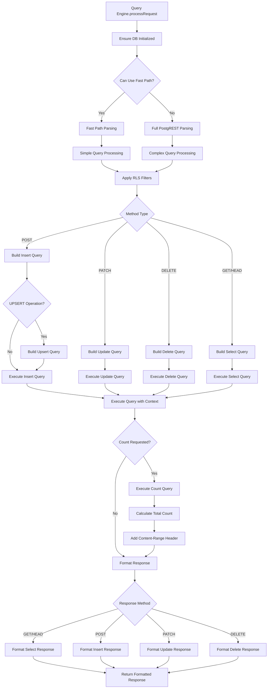
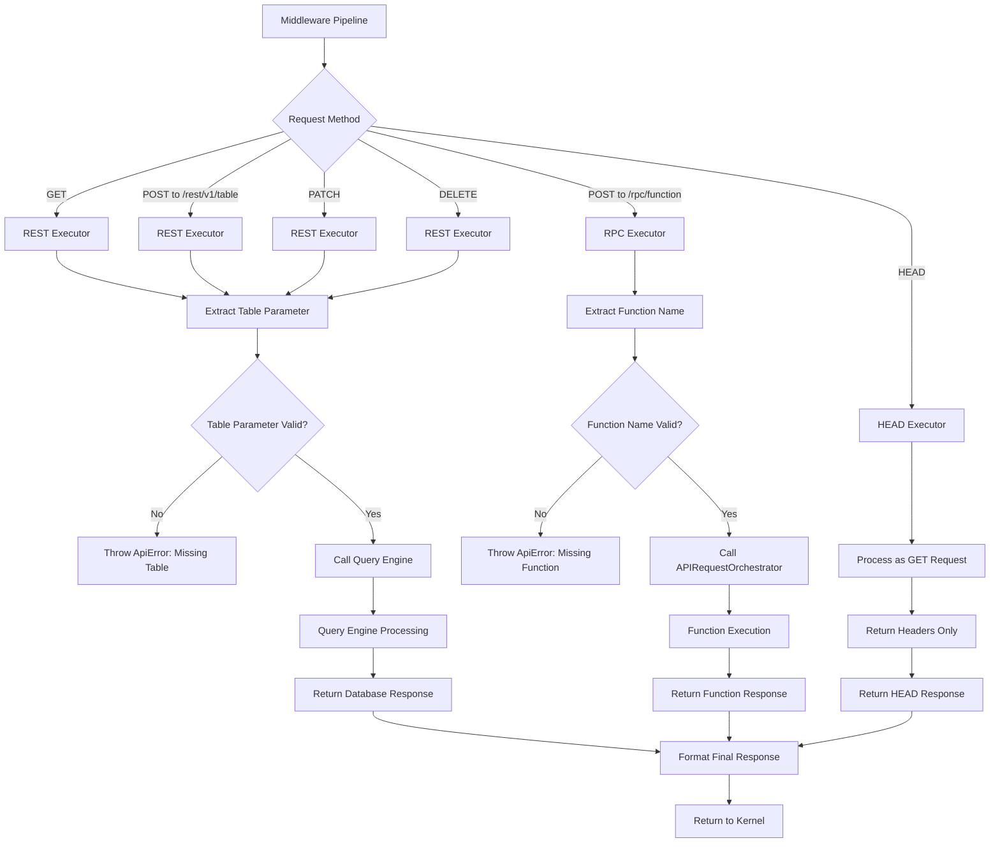
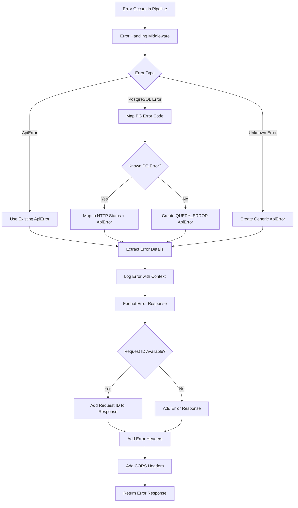
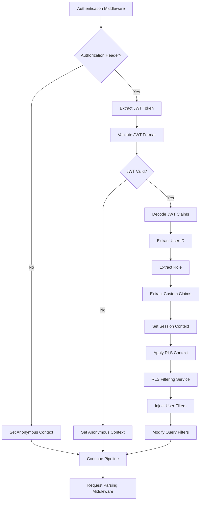

# Unified Kernel Request Flow Diagrams

This document provides visual flow diagrams for understanding how requests are processed through the **Unified Kernel Architecture**. The new system provides a much cleaner, single-path execution flow compared to the previous dual-bridge system.

## 1. Overall Unified Kernel Request Flow

```mermaid
flowchart TD
    A[HTTP Request] --> B{MSW Handler Match?}
    B -->|No| C[Pass Through to Network]
    B -->|Yes| D[createApiHandler]

    D --> E[Convert MSW Request → ApiRequest]
    E --> F[Initialize ApiContext]
    F --> G[Execute Middleware Pipeline]

    G --> H[Stage 1: Error Handling Middleware]
    H --> I[Stage 2: Instrumentation Middleware]
    I --> J[Stage 3: CORS Middleware]
    J --> K[Stage 4: Project Resolution Middleware]
    K --> L[Stage 5: Authentication Middleware]
    L --> M[Stage 6: Request Parsing Middleware]
    M --> N[Stage 7: Response Formatting Middleware]

    N --> O[Execute Executor]
    O --> P{Executor Type}
    P -->|REST| Q[REST Executor]
    P -->|HEAD| R[HEAD Executor]
    P -->|RPC| S[RPC Executor]

    Q --> T[Query Engine Processing]
    R --> T
    S --> U[APIRequestOrchestrator]

    T --> V[Database Execution]
    U --> V
    V --> W[Format Response]

    W --> X{Response Type}
    X -->|JSON| Y[HttpResponse.json]
    X -->|CSV| Z[HttpResponse (raw)]
    X -->|Text| AA[HttpResponse (raw)]

    Y --> BB[Return HTTP Response]
    Z --> BB
    AA --> BB
```

## 2. Middleware Pipeline Detailed Flow

```mermaid
flowchart TD
    A[ApiRequest + ApiContext] --> B[Middleware Pipeline Entry]

    B --> C[Stage 1: Error Handling]
    C --> D{Try Block Wrapper}
    D -->|Success| E[Stage 2: Instrumentation]
    D -->|Error| F[Catch All Errors]

    F --> G[Map Error to ApiError]
    G --> H[Format Error Response]
    H --> I[Return Error Response]

    E --> J[Generate Request ID]
    J --> K[Start Performance Tracking]
    K --> L[Stage 3: CORS]

    L --> M[Set CORS Headers]
    M --> N[Handle OPTIONS Preflight]
    N --> O[Stage 4: Project Resolution]

    O --> P{Project ID in URL?}
    P -->|No| Q[Use Default Project]
    P -->|Yes| R[Extract Project ID]
    R --> S[Switch Database Context]

    Q --> T[Stage 5: Authentication]
    S --> T

    T --> U{Authorization Header?}
    U -->|No| V[Anonymous Context]
    U -->|Yes| W[Decode JWT Token]
    W --> X[Set User Context]
    W --> Y[Setup RLS Context]

    V --> Z[Stage 6: Request Parsing]
    X --> Z
    Y --> Z

    Z --> AA[Parse URL Parameters]
    AA --> BB[Parse PostgREST Syntax]
    BB --> CC[Validate Query Format]
    CC --> DD[Build ParsedQuery]
    DD --> EE[Stage 7: Response Formatting]

    EE --> FF[Call Next (Executor)]
    FF --> GG[Format Response Data]
    GG --> HH[Set Content-Type Headers]
    HH --> II[Apply PostgREST Conventions]
    II --> JJ[Return Formatted Response]
```

## 3. Query Engine Processing Flow



## 4. Executor Pattern Flow



## 5. Error Handling Flow



## 6. Authentication and RLS Flow



## 7. Performance Monitoring Flow

```mermaid
flowchart TD
    A[Instrumentation Middleware] --> B[Generate Request ID]
    B --> C[Record Start Time]
    C --> D[Create Request Trace]

    D --> E[Store in Active Traces Map]
    E --> F[Setup Stage Reporting]
    F --> G[Continue Pipeline]

    G --> H[Each Middleware Stage]
    H --> I[Report Stage Entry]
    I --> J[Execute Stage Logic]
    J --> K[Report Stage Exit]
    K --> L[Record Stage Timing]

    L --> M{More Stages?}
    M -->|Yes| H
    M -->|No| N[Complete Request Trace]

    N --> O[Calculate Total Duration]
    O --> P[Update Performance Metrics]
    P --> Q[Move to Completed Traces]
    Q --> R[Enable Debug Tools Access]

    R --> S[window.mswDebug.getRecentTraces()]
    S --> T[Browser Debug Console]
```

## 8. Response Format Handling Flow

```mermaid
flowchart TD
    A[Response Formatting Middleware] --> B[Execute Next (Executor)]
    B --> C[Receive Executor Response]

    C --> D{CSV Format Requested?}
    D -->|Yes| E[Format as CSV]
    D -->|No| F[Format as JSON]

    E --> G[Convert Data to CSV String]
    G --> H[Set Content-Type: text/csv]
    H --> I[Return Raw Response]

    F --> J[Apply PostgREST Conventions]
    J --> K[Add Content-Range Headers]
    K --> L[Handle Single Object Response]
    L --> M[Set Content-Type: application/json]

    I --> N[Return to Kernel]
    M --> N

    N --> O[Kernel Response Handling]
    O --> P{Content Type}
    P -->|text/csv| Q[HttpResponse(data, options)]
    P -->|application/json| R[HttpResponse.json(data, options)]

    Q --> S[Return HTTP Response]
    R --> S
```

## 9. Debugging Decision Tree

When debugging issues with the unified kernel system:

```mermaid
flowchart TD
    A[API Request Issue] --> B{Response Received?}

    B -->|No| C[Check MSW Handler Match]
    C --> D{Handler Pattern Correct?}
    D -->|No| E[Fix MSW Handler Pattern]
    D -->|Yes| F[Check Kernel Execution]

    B -->|Yes| G{Status Code?}
    G -->|2xx| H[Check Response Format]
    G -->|4xx| I[Check Request Validation]
    G -->|5xx| J[Check Internal Errors]

    F --> K[Enable Verbose Logging]
    K --> L[window.mswDebug.enableVerboseLogging()]

    I --> M[Check Middleware Pipeline]
    M --> N{Which Stage Failed?}
    N -->|Auth| O[Check JWT Token]
    N -->|Parsing| P[Check PostgREST Syntax]
    N -->|Project| Q[Check Project ID Extraction]

    J --> R[Check Error Logs]
    R --> S{ApiError Type?}
    S -->|QUERY_ERROR| T[Check SQL Generation]
    S -->|AUTH_ERROR| U[Check Authentication]
    S -->|VALIDATION_ERROR| V[Check Request Format]

    H --> W{PostgREST Compatible?}
    W -->|No| X[Check Response Formatting]
    W -->|Yes| Y[Issue Resolved]

    O --> Z[Validate JWT in Auth Middleware]
    P --> AA[Validate Query Parsing Logic]
    Q --> BB[Validate Project Resolution]
    T --> CC[Check Query Engine Logic]
    U --> DD[Check Authentication Middleware]
    V --> EE[Check Request Parsing Middleware]
```

## Key Improvements Over Bridge System

### 1. **Simplified Execution Path**
- **Previous**: Multiple bridge selection logic with complex decision trees
- **Current**: Single middleware pipeline with predictable execution order

### 2. **Better Error Handling**
- **Previous**: Scattered error handling across different bridges
- **Current**: Centralized error handling middleware with standardized `ApiError`

### 3. **Enhanced Debugging**
- **Previous**: Difficult to trace which bridge handled a request
- **Current**: Complete request tracing with `window.mswDebug` tools

### 4. **Performance Monitoring**
- **Previous**: Limited visibility into request processing time
- **Current**: Per-stage timing and comprehensive performance metrics

### 5. **Type Safety**
- **Previous**: Inconsistent typing across different bridges
- **Current**: Comprehensive TypeScript interfaces throughout pipeline

## Debugging Tools Usage

### Browser Console Commands
```javascript
// View system status
window.mswDebug.status()

// Get recent request traces
window.mswDebug.getRecentTraces()

// Enable detailed logging
window.mswDebug.enableVerboseLogging()

// View performance stats
window.mswDebug.getBridgeStats()

// Get kernel information
window.mswDebug.kernelInfo()
```

### Request Tracing Example
```javascript
// After making a request, view the trace
const traces = window.mswDebug.getRecentTraces()
const lastTrace = traces[0]

console.log('Request ID:', lastTrace.requestId)
console.log('Total Duration:', lastTrace.duration, 'ms')
console.log('Stages:')
lastTrace.stages.forEach(stage => {
  console.log(`  ${stage.stage}: ${stage.duration}ms`)
})
```

The unified kernel architecture provides a much cleaner, more debuggable request flow that eliminates the complexity of the previous bridge system while maintaining superior PostgREST compatibility.