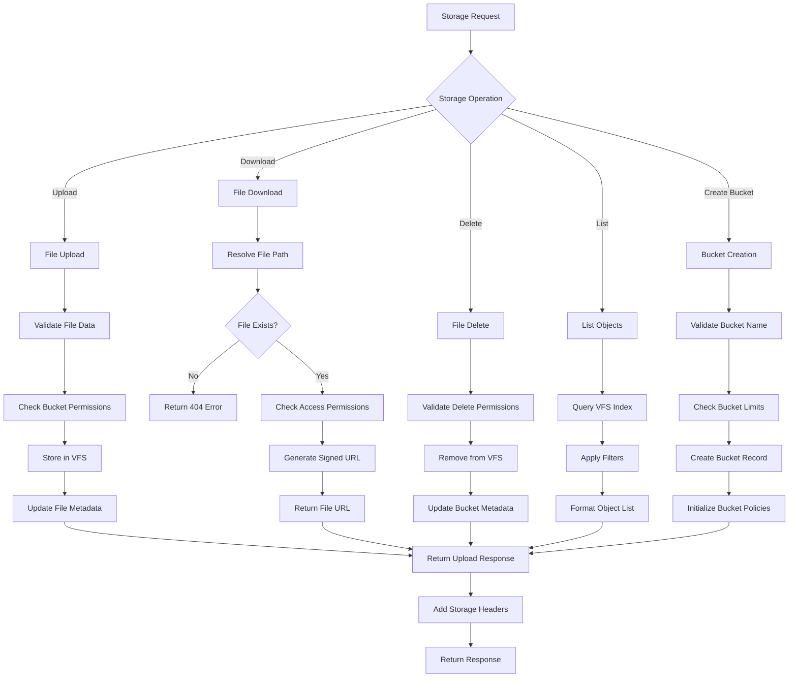

# MSW API Request Flow Diagrams

This document provides visual flow diagrams for understanding how requests are processed through the MSW API system. These diagrams are essential for debugging and understanding the complex execution paths.

## 1. Overall Request Flow

## 2. Project Resolution Flow

## 3. Bridge Selection Decision Tree

## 4. Enhanced Bridge Query Processing

## 5. Authentication Flow

## 6. Error Handling Flow

## 7. Storage/VFS Operation Flow

## 8. Debugging Decision Tree

When debugging API requests, follow this decision tree:

## Key Insights from Flow Analysis

### 1. **Critical Decision Points**
- **Project Resolution**: Determines database context for entire request
- **Bridge Selection**: Affects query parsing and SQL generation capabilities
- **RLS Application**: Can filter results unexpectedly if user context is wrong

### 2. **Common Failure Points**
- **URL Pattern Matching**: Incorrect handler selection leads to wrong processing
- **Project Database Switching**: Stale connections cause data inconsistencies
- **Query Parsing**: Complex PostgREST syntax can fail silently

### 3. **Performance Bottlenecks**
- **Project Resolution Cache**: Cache misses cause database switching overhead
- **Complex Query Parsing**: Enhanced bridge parsing for embedded resources
- **RLS Filter Application**: User context extraction and filter injection

### 4. **Debugging Strategies**
- **Trace Request ID**: Follow single request through all flow stages
- **Log Bridge Selection**: Verify correct bridge handles request
- **Monitor Cache Performance**: Check project resolution cache hit rates
- **Validate SQL Generation**: Ensure PostgREST syntax converts correctly

These diagrams provide the visual foundation for understanding the MSW API system's complexity and serve as debugging guides for identifying where issues occur in the request processing pipeline.