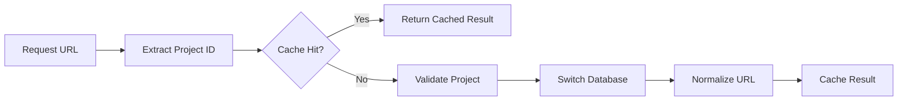

# API Call Tracing Guide

## Overview

This guide provides step-by-step instructions for tracing API calls through the MSW system to identify exactly which code path handles a request and where issues might occur.

## Quick Tracing Checklist

1. **🔍 Identify the request** - URL pattern and HTTP method
2. **📍 Find the MSW handler** - Which handler matches the request
3. **🗃️ Trace project resolution** - How project ID is extracted and database switched
4. **🌉 Determine bridge selection** - Enhanced vs Simplified vs Auth vs Storage
5. **📝 Follow query parsing** - How URL parameters become database queries
6. **💾 Trace database execution** - SQL generation and execution
7. **📤 Validate response formatting** - How results are formatted for the client

## Step-by-Step Tracing

### Step 1: Identify the Request

**What to check:**
- Request URL and HTTP method
- Request headers (Authorization, Content-Type, Prefer)
- Request body (for POST/PATCH requests)

**Browser DevTools:**
```javascript
// Open Network tab, find the request, check:
// - General: Request URL, Method, Status Code  
// - Request Headers: Authorization, apikey, Prefer
// - Response Headers: Content-Range, Content-Type
```

**Console debugging:**
```javascript
// Add this to any handler to see all requests
console.log('MSW Request:', {
  method: req.method,
  url: req.url,
  headers: Object.fromEntries(req.headers.entries()),
  body: await req.text()
})
```

### Step 2: Find the MSW Handler

**Handler matching order** (from `src/mocks/handlers/index.ts`):
1. Auth handlers (`/auth/v1/*`)
2. REST handlers (`/rest/v1/*`) 
3. Project handlers (`/:projectId/*`)
4. Debug handlers (`/debug/*`)
5. Health handlers (`/health`)
6. Storage handlers (`/storage/v1/*`)
7. VFS direct handlers (`/vfs/*`)
8. App hosting handlers (`/app/*`)
9. Functions handlers (`/functions/v1/*`)
10. CORS catch-all (last)

**Debugging handler selection:**
```javascript
// Add to start of each handler in handlers/
export const restHandlers = [
  http.get('/rest/v1/:table', async ({ request, params }) => {
    console.log('✅ REST handler matched:', request.url)
    // ... rest of handler
  })
]
```

**Common handler patterns:**
```javascript
// Direct routes (no project)
'/rest/v1/:table'
'/auth/v1/signup'
'/storage/v1/object/:bucket/*'

// Project-scoped routes  
'/:projectId/rest/v1/:table'
'/:projectId/auth/v1/signup'
'/:projectId/storage/v1/object/:bucket/*'
```

### Step 3: Trace Project Resolution

**Project resolution flow:**


**Debug project resolution:**
```javascript
// Add to withProjectResolution in project-resolver.ts
console.log('🗃️ Project Resolution:', {
  originalUrl: req.url,
  projectId: extractedProjectId,
  cacheHit: cacheResult ? 'HIT' : 'MISS', 
  normalizedUrl: normalizedUrl,
  dbSwitched: dbSwitchResult
})
```

**Check project cache:**
```javascript
// In browser console
window.projectCache = {
  hits: 0,
  misses: 0,
  entries: new Map()
}
// Monitor cache performance
```

### Step 4: Determine Bridge Selection

**Bridge selection logic:**
```javascript
// Current bridge selection (in handlers/rest.ts)
const USE_SIMPLIFIED_BRIDGE = false
const activeBridge = USE_SIMPLIFIED_BRIDGE ? simplifiedBridge : enhancedBridge

// Debug bridge selection
console.log('🌉 Bridge Selection:', {
  useSimplified: USE_SIMPLIFIED_BRIDGE,
  selectedBridge: activeBridge.constructor.name,
  requestType: determineRequestType(req)
})
```

**Bridge routing by request type:**
- **REST API** → Enhanced/Simplified Bridge
- **Auth endpoints** → Auth Bridge  
- **Storage operations** → VFS Bridge
- **Functions** → Inline handlers
- **Debug SQL** → Direct database access

### Step 5: Follow Query Parsing

#### Enhanced Bridge Query Parsing
```javascript
// Add to enhanced-bridge.ts handleRestRequest()
console.log('📝 Enhanced Bridge Parsing:', {
  originalQuery: urlParams.toString(),
  parsedFilters: extractedFilters,
  embeddedResources: embeddedStructure,
  orderBy: orderingClause,
  pagination: paginationInfo
})
```

#### Simplified Bridge Query Parsing
```javascript
// Add to simplified-bridge.ts handleRestRequest()
console.log('📝 Simplified Bridge Parsing:', {
  basicFilters: simpleFilters,
  orderBy: simpleOrder,
  limit: limitValue,
  offset: offsetValue
})
```

**Query parsing checkpoints:**
1. **URL parameter extraction** - `new URLSearchParams()`
2. **Filter parsing** - `column=operator.value`
3. **Embedding detection** - `select=*,relation(*)`
4. **Ordering parsing** - `order=column.direction`
5. **Pagination parsing** - `Range` header or `limit`/`offset`

### Step 6: Trace Database Execution

**SQL generation debugging:**
```javascript
// Add before database execution
console.log('💾 Database Execution:', {
  generatedSQL: finalSQL,
  parameters: queryParameters,
  userContext: currentUserContext,
  rlsFilters: appliedRLSFilters
})
```

**Database execution flow:**
```javascript
// Monitor database calls
const originalQuery = DatabaseManager.query
DatabaseManager.query = function(sql, params) {
  console.log('🗄️ DB Query:', { sql, params })
  const start = performance.now()
  const result = originalQuery.call(this, sql, params)
  console.log('🗄️ DB Result:', { 
    duration: performance.now() - start,
    rowCount: result.rows?.length 
  })
  return result
}
```

**Common database issues:**
- **SQL syntax errors** - Check generated SQL validity
- **RLS filter problems** - Verify user context injection
- **Performance issues** - Monitor query execution time
- **Connection issues** - Verify project database switching

### Step 7: Validate Response Formatting

**Response formatting debugging:**
```javascript
// Add before returning response
console.log('📤 Response Formatting:', {
  rawResults: databaseResults,
  formattedResponse: finalResponse,
  statusCode: responseStatus,
  headers: responseHeaders
})
```

**PostgREST response format requirements:**
```javascript
// Expected response structure
{
  // Success responses
  data: [...],                    // Array of results
  count: number,                  // Total count (if requested)
  
  // Headers
  'Content-Range': '0-9/100',     // Pagination info
  'Content-Type': 'application/json'
}
```

## Browser DevTools Debugging

### Network Tab Analysis
1. **Request details** - URL, method, headers, body
2. **Response details** - Status, headers, body
3. **Timing** - DNS, connect, send, wait, receive
4. **Security** - CORS, certificates, mixed content

### Console Debugging Strategies

#### Enable MSW debugging:
```javascript
// In browser console
localStorage.setItem('MSW_DEBUG', 'true')
// Reload page to see MSW request interception logs
```

#### Custom request tracing:
```javascript
// Add request ID for tracing
const requestId = Math.random().toString(36).substr(2, 9)
console.log(`🔍 [${requestId}] Request start:`, req.url)

// Trace through each step
console.log(`🗃️ [${requestId}] Project resolution:`, projectResult)
console.log(`🌉 [${requestId}] Bridge selection:`, bridgeType)
console.log(`📝 [${requestId}] Query parsing:`, parsedQuery)
console.log(`💾 [${requestId}] Database execution:`, dbResult)
console.log(`📤 [${requestId}] Response formatting:`, response)
```

#### Monitor bridge selection:
```javascript
// Track which bridge handles requests
window.bridgeStats = { enhanced: 0, simplified: 0, auth: 0, storage: 0 }

// Increment in each bridge
window.bridgeStats.enhanced++
console.log('Bridge stats:', window.bridgeStats)
```

### Performance Tracing

#### Measure request processing time:
```javascript
// Add to handler start
const start = performance.now()

// Add to handler end  
const duration = performance.now() - start
console.log(`⏱️ Request processing time: ${duration.toFixed(2)}ms`)
```

#### Monitor memory usage:
```javascript
// Check memory periodically
setInterval(() => {
  if (performance.memory) {
    console.log('Memory usage:', {
      used: Math.round(performance.memory.usedJSHeapSize / 1024 / 1024) + 'MB',
      total: Math.round(performance.memory.totalJSHeapSize / 1024 / 1024) + 'MB'
    })
  }
}, 5000)
```

## Common Debugging Scenarios

### Scenario 1: Request Not Being Intercepted
**Symptoms:** Request goes to actual network instead of MSW
**Debug steps:**
1. Check MSW is enabled: `localStorage.getItem('MSW_DEBUG')`
2. Verify handler patterns match request URL
3. Check handler order in `handlers/index.ts`
4. Ensure CORS preflight is handled

### Scenario 2: Wrong Bridge Handling Request
**Symptoms:** Unexpected query parsing or missing features
**Debug steps:**
1. Check `USE_SIMPLIFIED_BRIDGE` flag
2. Verify request type detection logic
3. Confirm handler routing to correct bridge
4. Check bridge capability matrix

### Scenario 3: Database Query Failures
**Symptoms:** SQL errors or unexpected results
**Debug steps:**
1. Log generated SQL and parameters
2. Test SQL directly with debug endpoint
3. Check RLS filter application
4. Verify project database switching

### Scenario 4: Response Format Issues
**Symptoms:** Client can't parse response
**Debug steps:**
1. Compare response to PostgREST format
2. Check Content-Type headers
3. Verify CORS headers present
4. Validate JSON structure

## Advanced Tracing Techniques

### Request Flow Visualization
```javascript
// Create visual trace of request flow
const trace = []
trace.push(`Handler: ${handlerName}`)
trace.push(`Project: ${projectId}`) 
trace.push(`Bridge: ${bridgeName}`)
trace.push(`Query: ${parsedQuery}`)
trace.push(`Result: ${resultSummary}`)
console.table(trace)
```

### Conditional Debugging
```javascript
// Only debug specific patterns
const shouldDebug = req.url.includes('/users') || req.method === 'POST'
if (shouldDebug) {
  console.group('🔍 Debugging request:', req.url)
  // ... detailed logging
  console.groupEnd()
}
```

### Error Context Tracking
```javascript
// Attach context to errors
try {
  // ... operation
} catch (error) {
  console.error('❌ Error with context:', {
    error: error.message,
    request: req.url,
    bridge: bridgeName,
    query: parsedQuery,
    userContext: userInfo
  })
  throw error
}
```

This tracing guide provides the tools and techniques needed to efficiently debug any API request through the MSW system, significantly reducing the time needed to identify and fix issues.